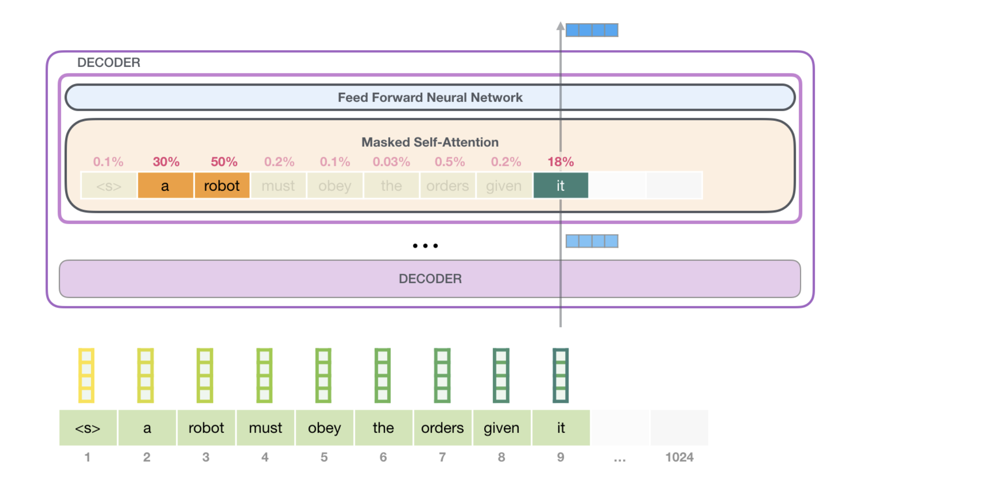

 Open Ai released the source code for GPT 2 and it is light weight making it perfect tool to play with. 

 

Experimented infrastrucre see how I can make small changes in things like normalization, dropping out layers, or making funmential shifts in layer arrangment. 

Fine-tuned a few models and add a small RAG. 

Create a final pipeline for a working system.

